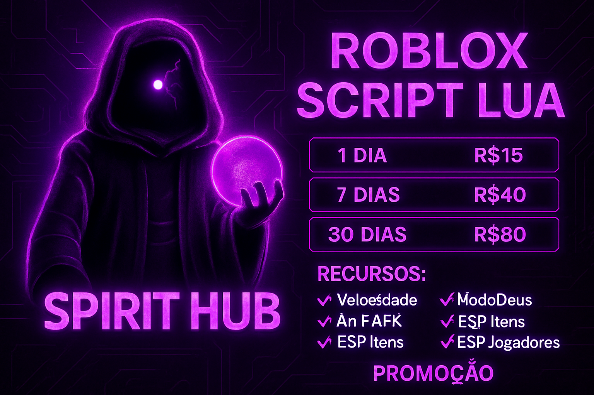
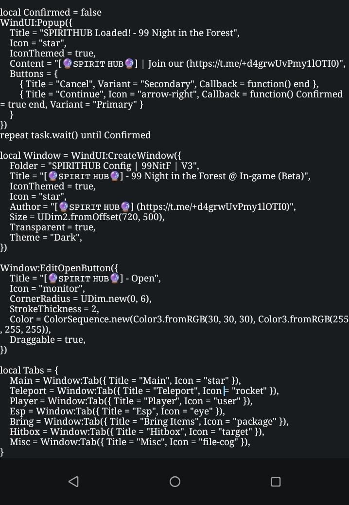
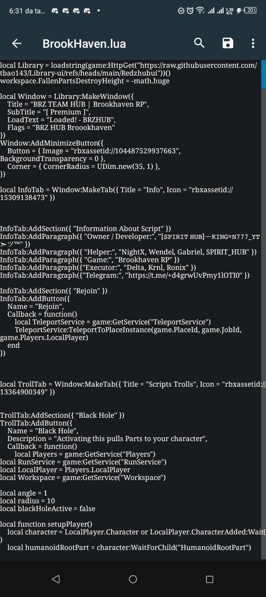
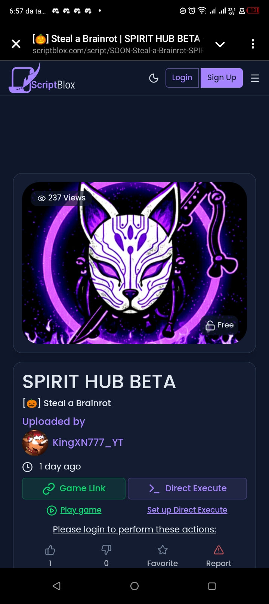

# SPIRIT HUB | Spirit_Core

  

Bem-vindo ao repositório oficial do **Spirit_Core**, o coração e a alma do **SPIRIT HUB**. Este projeto é a prova da dedicação, resiliência e paixão pela programação em Luau para Roblox.

## 👑 Sobre o Dono

Eu sou **[𝚂𝙿𝙸𝚁𝙸𝚃 𝙷𝚄𝙱]⏤‌‌‌‌𝙺𝙸𝙽𝙶×𝙽𝟽𝟽𝟽_𝚈𝚃➣ツ**, um programador especialista em Luau de 18 anos e o único dono e desenvolvedor por trás do SPIRIT HUB.

Com uma vasta experiência, incluindo projetos com mais de **13.000 linhas de código** e um portfólio de **165 arquivos `.lua` completos**, minha missão é inovar e entregar scripts de alta qualidade para a comunidade Roblox.

## 📜 A História do SPIRIT HUB

O SPIRIT HUB nasceu em **2025** de uma jornada turbulenta, marcada por desafios, mas que culminou em um projeto mais forte e autêntico.

### O Início e a Crise

A ideia inicial começou com um parceiro, mas o desenvolvimento enfrentou um revés. Uma versão inicial do script, que continha código-fonte público modificado, foi acidentalmente vazada. Este incidente gerou uma crise de confiança e permitiu que terceiros mal-intencionados tentassem se aproveitar do código.

### A Virada e a Consolidação

Após o incidente, o co-fundador original se afastou. Foi nesse momento que eu, **King**, assumi o controle total e me tornei o único dono do SPIRIT HUB. Decidi reconstruir o projeto do zero, focando em código original, segurança e desempenho superior.

Enquanto concorrentes tentavam se promover com projetos inferiores (como o Rush Client) e até mesmo tentavam sabotar minhas vendas, eu me concentrei no que faço de melhor: **programar**. O resultado é um projeto robusto, seguro e inovador, que reflete minha verdadeira capacidade como desenvolvedor Luau.

> O SPIRIT HUB de hoje é um símbolo de superação. Cada linha de código foi escrita com o objetivo de ser superior, mais estável e mais poderoso do que qualquer imitação.

### 🚀 A Busca pela Superação

Apesar de manter uma relação amigável com o antigo co-fundador, a ambição de superar o passado e as tentativas de desvalorização persistem. O foco é total no desenvolvimento, provando que a qualidade e a dedicação ao código são a verdadeira medida de sucesso, superando qualquer alegação de superioridade ou grupos "roubados" de terceiros.

  

## 📸 Galeria do Projeto

Confira alguns exemplos do desenvolvimento e da interface do SPIRIT HUB:

| Interface de Configuração | Informações do Script | Listagem Oficial |
| :---: | :---: | :---: |
|  |  |  |

---

*Desenvolvido com paixão por **[𝚂𝙿𝙸𝚁𝙸𝚃 𝙷𝚄𝙱]⏤‌‌‌‌𝙺𝙸𝙽𝙶×𝙽𝟽𝟽𝟽_𝚈𝚃➣ツ**.*
